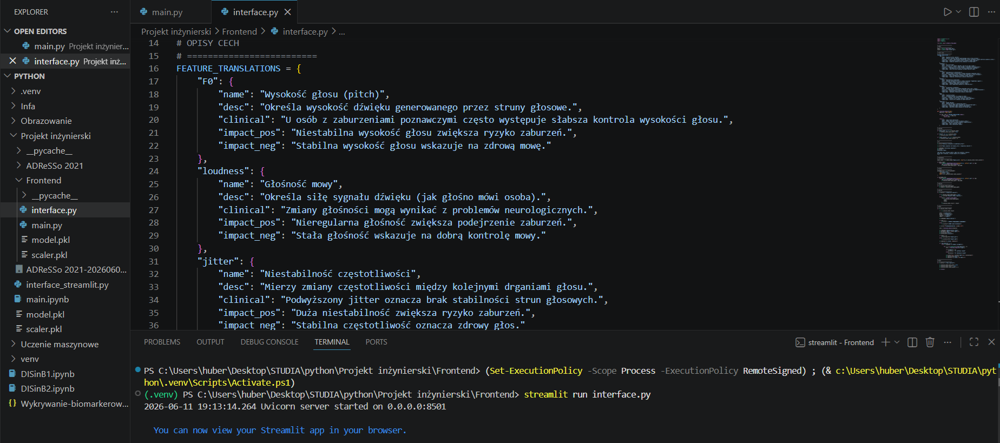

## Uruchomienie interfejsu użytkownika

Interfejs aplikacji został zaimplementowany w pliku `interface.py` z wykorzystaniem biblioteki Streamlit.

Aby uruchomić aplikację, należy:

1. Otworzyć projekt i przejść do pliku `interface.py`.
2. Uruchomić terminal w katalogu zawierającym plik `interface.py`.
3. Wykonać polecenie:

```bash
streamlit run interface.py
```

4. Po uruchomieniu polecenia aplikacja zostanie uruchomiona, a interfejs użytkownika powinien automatycznie otworzyć się w domyślnej przeglądarce internetowej.

Jeżeli strona nie otworzy się automatycznie, należy skopiować adres URL wyświetlony w terminalu i wkleić go ręcznie do przeglądarki.

### Widok aplikacji


